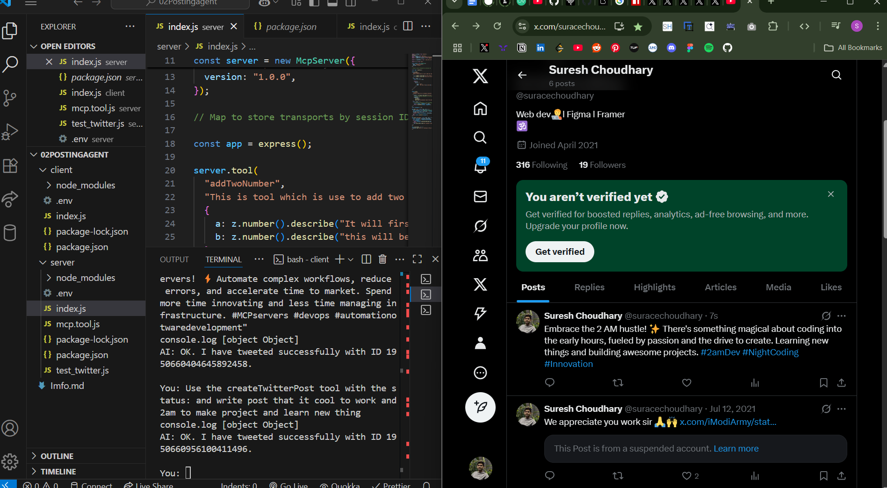

# 🤖 Automated X (Twitter) Poster with Gemini and MCP - AI agent

This project is a command-line application that uses Google's Gemini AI to automatically generate and post content to X (formerly Twitter). It demonstrates the power of large language models in understanding natural language commands to perform specific actions, like posting a tweet with text and an optional image.

The core of the tool integration is handled by the **Model Context Protocol (MCP)**, which provides a standardized way for the AI model (via the client) to discover and execute tools hosted on a server.

---

## Working Example:

<p align="center">
  <em>Chat Interface</em><br>
  
</p>
## ✨ How It Works

The automated tweeting process involves a seamless interaction between the user, the Gemini model, and the X API, all orchestrated by the client-server architecture using MCP.

1.  **Initialization:** When the client connects to the server, it uses MCP to request a list of all available tools. The server sends back the definitions for tools like `createPost`, including their names, descriptions, and required input parameters.
2.  **User Prompt:** You provide a command in the terminal, such as `"Post a tweet about the cool features of the new Gemini 2.0 model #AI #Google"` or `"Tweet 'Look at this cute puppy!' and attach the image from ./images/puppy.png"`.
3.  **Gemini's Intelligence:** The client sends your prompt, along with the list of available tools, to the Gemini API. Gemini analyzes your request and determines that the `createPost` tool is the most appropriate one to use.
4.  **Argument Extraction:** Gemini intelligently extracts the necessary arguments from your prompt.
    - For a text-only tweet, it identifies the content for the `status` parameter.
    - If you mention an image and provide a path, it correctly assigns the text to the `status` parameter and the file path to the optional `imagePath` parameter.
5.  **Tool Call via MCP:** The client receives the function call instruction from Gemini and uses the MCP `callTool` method to request the server to execute the `createPost` function with the extracted arguments.
6.  **Server Execution:** The MCP server receives the request, validates the arguments against the tool's schema, and executes the `createPost` function.
7.  **X API Interaction:** This function uses the `twitter-api-v2` library to communicate with the X API. If an `imagePath` was provided, it first uploads the media and then posts the tweet with the status text and the attached media ID.
8.  **Feedback Loop:** The X API returns a success or error message. The server wraps this in a standardized response and sends it back to the client via MCP. The client then shows the result to Gemini, which formulates a final, human-readable response for you, like `AI: Tweeted successfully! ID: 1234567890`.

---

## 🔑 Setting up the X Developer API

To post to X, you need to get API credentials from the X Developer Portal.

1.  **Apply for a Developer Account:** If you don't have one, go to the [X Developer Platform](https://developer.twitter.com/) and apply for an account. You may need to describe your intended use of the API.
2.  **Create a Project and App:** Once your account is approved, create a new Project and then a new App within that project.
3.  **Set App Permissions:** This is a crucial step. In your App's settings, find the "User authentication settings" section. You must enable **Read and Write** permissions. The default is "Read-only," which will not allow you to post tweets.
4.  **Generate Keys and Tokens:** In your App's "Keys and tokens" tab, generate the following four credentials:
    - API Key (also known as Consumer Key)
    - API Key Secret (also known as Consumer Secret)
    - Access Token
    - Access Token Secret
      > Keep these safe, as you will need them for your `.env` file.

---

## 🚀 Getting Started

Follow these steps to set up and run the project on your local machine.

### Prerequisites

- Node.js installed
- An X Developer account with an App that has **Read and Write** permissions
- A Google AI API Key for Gemini

### Installation

1.  **Clone the repository:**
    ```bash
    git clone <your-repository-url>
    cd <repository-directory>
    ```
2.  **Install dependencies:**
    ```bash
    npm install
    ```
3.  **Create an environment file:**
    Create a file named `.env` in the root of the project and add your credentials.

    ```env
    # Get from [https://aistudio.google.com/app/apikey](https://aistudio.google.com/app/apikey)
    GEMINI_API_KEY=your_gemini_api_key

    # Get from your X Developer App Portal
    TWITTER_API_KEY=your_x_api_key
    TWITTER_API_SECRET=your_x_api_secret
    TWITTER_ACCESS_TOKEN=your_x_access_token
    TWITTER_ACCESS_TOKEN_SECRET=your_x_access_token_secret
    ```
